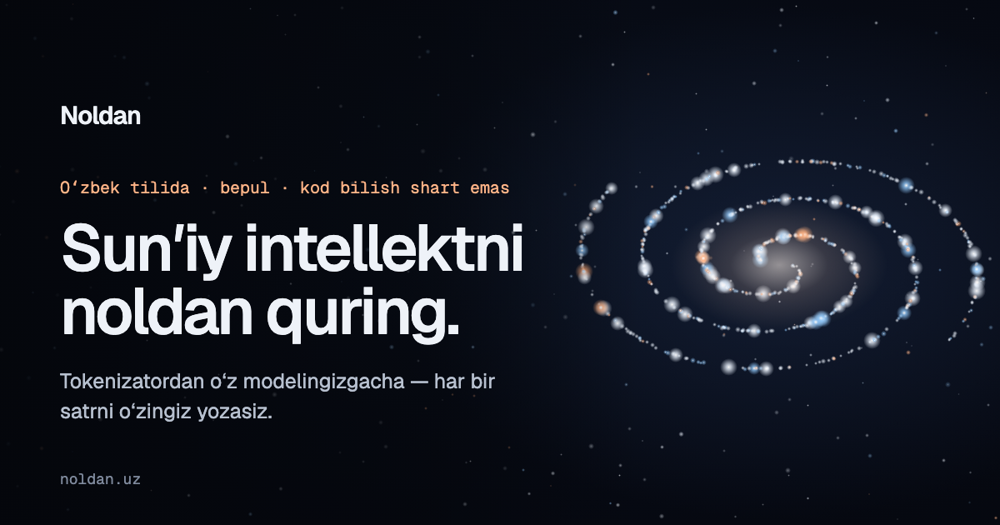

# Noldan



**Noldan** ("from zero") is a free course, in Uzbek, that teaches people with no
programming background to build a language model from scratch — starting with
the part every AI system has and almost nobody explains: the tokenizer.

Tokenizers trained mostly on English cut Uzbek text into far more pieces than
English. The same sentence costs more, runs slower and fits less into a
model's memory. The course measures that gap, explains where it comes from
(Unicode, UTF-8, how byte-pair encoding learns), and has the student build a
tokenizer for Uzbek themselves, line by line.

## What is in it

- **Kurs 1 — Tokenizator qurish** (free): lessons 01–09 so far, from a first
  `print` to a working byte-level BPE `merge`. Every lesson is real Python that
  the student types and runs.
- **Kurs 2 — Transformer (GPT) qurish** (paid, in preparation).

## How the site works

- **Lessons are Markdown.** The author writes a lesson as a `.md` file; the
  build turns it into a page — code blocks, printed output, diagrams,
  answers that open on request, exercises. See [`content/README.md`](content/README.md).
- **Code is typed, not copied.** Each code block is a typing exercise: grey
  placeholder text that turns into highlighted code as the student types it,
  red on a mistake. "Copy" unlocks only when the block is typed correctly.
- **Every example is checked.** `npm run check:lessons` runs all the course's
  code in order, as a student would, and compares it with the output printed
  in the lessons.
- **Readable by search engines.** Every page is pre-rendered to static HTML
  at build time, with its own title, description, structured data and the
  full lesson text; the sitemap updates itself.
- **Accounts without passwords.** Sign in with Telegram or Google
  ([Better Auth](https://better-auth.com) running in the site's own API, data in
  Postgres). No emails, no password resets.
- **Payments** through Payme and Click, the card rails used in Uzbekistan.
  The paid lesson text is served only by the API, after an entitlement check.

## Stack

React 19 · TypeScript · Vite · Canvas 2D (the star field) · Vercel Functions ·
Better Auth · PostgreSQL (Neon) · Payme / Click · PGlite (tests)

```
content/        lessons, one Markdown file each
src/stars/      the landing page and its particle engine
src/experience/ lesson pages, playground, project page
src/components/ typing trainer, lesson blocks, media slots
api/            serverless functions: sign-in, lessons, payments, tutor
db/schema.sql   the whole database
scripts/        lesson pipeline, pre-rendering, checks, deploy helpers
```

## Running it

```bash
npm install
npm run dev          # http://localhost:5173
```

The free course, the playground and the landing page work with nothing else
set up. For accounts locally, `npm run db:dev` starts a throwaway Postgres;
see [`.env.example`](.env.example).

## Adding lessons and videos

```bash
npm run add:lesson -- ~/Downloads/noldan-1-dars-10.md
npm run add:video  -- ~/Downloads/c1.mp4 dars-01
npm run check:lessons
```

Push to `main` and the site redeploys itself.

## Checks

```bash
npm run check:lessons   # every lesson's code against its printed output
npm run test:payments   # 41 assertions on the Payme and Click state machines
npm run build           # type-check, build, pre-render
```

## Deploying

[`DEPLOY.md`](DEPLOY.md) — GitHub, Vercel, the domain, sign-in, payments, and
Google Search Console, in order.

---

Built by **Islombek Turdiyev**.
